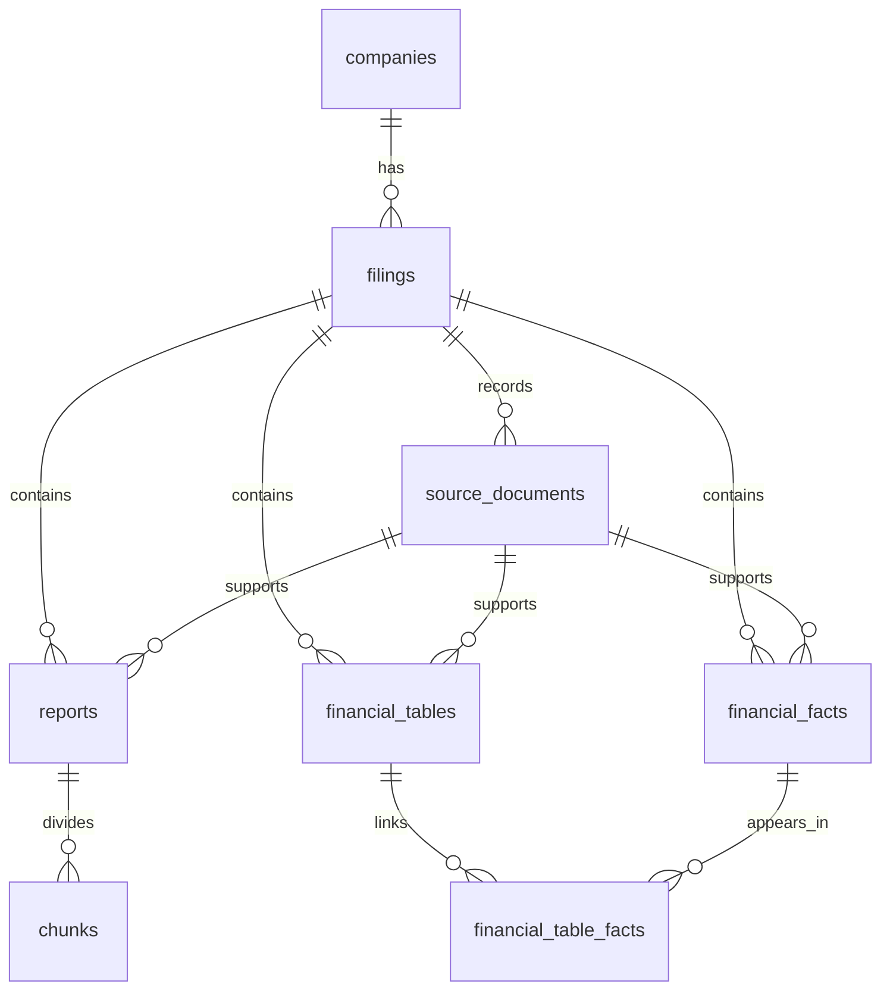

# PostgreSQL database foundation

The database stores SEC filing metadata, source provenance, and versioned outputs from teammate loaders. The included Microsoft sample seeds **one company, one filing, and four source documents**. It does not extract or load financial facts, cleaned reports, tables, or chunks.

The shared RDS database additionally contains a separately inserted [manual formatted example](manual-example.md), version `manual-example-v1`. The seed command and local setup described below still load metadata only.

The foundation follows the KPMG database design supplied with the implementation plan. PostgreSQL runs locally in Docker. Python uses synchronous `psycopg`; there is no ORM or HTTP service.

## Start on Windows

Run these commands in PowerShell from the repository root. Install [uv](https://docs.astral.sh/uv/getting-started/installation/) if it is not available, then start Docker Desktop and wait until its engine is available. Use a shell without `PG*` connection overrides from a previous RDS session so the Python commands below use the local `.env` settings.

```powershell
docker info
uv sync --locked
if (-not (Test-Path .env)) { Copy-Item .env.example .env }
notepad .env
```

Replace `CHANGE_ME` with a strong local password before starting the database. A random alphanumeric password avoids interpolation differences between Compose and Python's simple `KEY=value` parser. Use literal configuration values without variable references or inline comments. Keep `.env` private; it is ignored by Git. Leave `POSTGRES_DB=sec_filings` and `POSTGRES_USER=sec_admin` for the commands in this guide. If port 5432 is occupied, change `POSTGRES_PORT` in `.env`.

```powershell
docker compose up -d --wait
if ($LASTEXITCODE -ne 0) { throw 'Local database startup failed.' }
uv run --locked sec-db migrate
if ($LASTEXITCODE -ne 0) { throw 'Database migration failed.' }
uv run --locked sec-db seed-manifest --manifest source_manifest.json --data-root .
if ($LASTEXITCODE -ne 0) { throw 'Metadata seed failed.' }
uv run --locked sec-db status
```

Use `.\.tools\integration-uv\bin\uv.exe` in place of `uv` if using the repository's existing local executable. Python 3.12.14 is pinned by `.python-version`.

The seed verifies the manifest and the sizes and SHA-256 hashes of the three entries in `files` and the separate `index_document` before opening a write transaction. These four records reference the original files under `data/raw/sec/`; source bytes are not copied into PostgreSQL or modified. No SEC or other HTTP requests are required by database ingestion. Installing dependencies and pulling the container image can use the network.

After seeding a newly created database, expect these counts. Seeding an existing database leaves other records in place, so its totals may be higher.

| Table | Rows |
| --- | ---: |
| `sec.companies` | 1 |
| `sec.filings` | 1 |
| `sec.source_documents` | 4 |
| `sec.reports`, `sec.chunks`, `sec.financial_facts`, `sec.financial_tables`, `sec.financial_table_facts` | 0 each |

Repeat `migrate` and `seed-manifest` safely. Identical records retain their UUIDs. A changed existing record fails explicitly instead of silently replacing provenance.

## Configuration and commands

Compose provides one `db` service in project `sec-filings`. Its PostgreSQL 17 image is pinned, its port binds to `127.0.0.1`, and database files persist in the `postgres_data` named volume. The volume outlives a stopped or recreated container. `sec_admin` is the bootstrap administrator for this local development database. The shared database is already deployed on AWS RDS; see [deployment status and access management](aws-deployment.md) for the existing hosted environment.

| Setting | Purpose |
| --- | --- |
| `POSTGRES_DB` | Initial database name; `sec_filings` in the example |
| `POSTGRES_USER` | Local database owner; `sec_admin` in the example |
| `POSTGRES_PASSWORD` | Local password; set in ignored `.env` |
| `POSTGRES_PORT` | Published local port; defaults to `5432` |
| `PGHOST`, `PGPORT`, `PGDATABASE`, `PGUSER`, `PGPASSWORD` | Python connection overrides; each overrides the corresponding local default or `POSTGRES_*` value |
| `PGSSLMODE`, `PGSSLROOTCERT` | Optional TLS mode and CA certificate path; use `verify-full` and the AWS CA bundle for RDS |

`sec-db` reads `.env` by default if present. Process environment values replace the same keys from the file; `PG*` keys then take precedence over `POSTGRES_*` keys. Use a different file with the global option before the subcommand:

```powershell
uv run --locked sec-db --env-file .env.local status
uv run --locked sec-db --help
```

The first command assumes you have created `.env.local` with the desired connection settings. To inspect RDS with an authorized maintainer login, use `.env.aws` instead. A reader limited to views should use `sec.filing_catalog`; `status` also needs access to the migration ledger and all data tables.

Do not put a password in a command argument or connection URL. The Python connection defaults to `127.0.0.1`. Standard `PG*` overrides affect Python connections; they do not reconfigure Compose.

| Command | Behavior |
| --- | --- |
| `sec-db migrate` | Apply new numbered SQL migrations transactionally; validate hashes of applied migrations |
| `sec-db seed-manifest --manifest PATH --data-root PATH` | Verify local evidence and atomically register company, filing, and source documents |
| `sec-db status` | Report database, migration, and row-count status |

Changing `POSTGRES_USER`, `POSTGRES_PASSWORD`, or `POSTGRES_DB` after the persistent volume is initialized does not reinitialize PostgreSQL. Keep existing connection settings unless intentionally administering the existing database.

The original `sec-pipeline` exporter and `scripts/download_sec_sample.py` retain their existing behavior and source-access requirements.

## Schema and loader contract



All data tables live in schema `sec`. Primary record IDs are UUIDs, except the table-to-fact link's composite key. Cross-record references enforce the filing boundary, so a report, fact, or table cannot cite a source document from another filing, and a table cannot link a fact from another filing.

| Table | Data and identity |
| --- | --- |
| `companies` | `cik` (10-character text, unique), `name`, optional `ticker` |
| `filings` | `company_id`, unique `accession_number`, `form`, `filing_date`, optional `reporting_period_end`, `source_url`, `amendment_of_id`; amendments must reference the same company |
| `source_documents` | `filing_id`, `role`, `source_url`, `local_path`, `sha256`, `size_bytes`, `retrieved_at`; identity is `(filing_id, local_path)` |
| `reports` | `filing_id`, `source_document_id`, `extraction_version`, `full_text`, `sections`; identity is `(source_document_id, extraction_version)` |
| `chunks` | `filing_id`, `report_id`, `chunking_version`, `chunk_index`, `section`, `text`, `offset_start`, `offset_end`, `metadata`; identity is `(report_id, chunking_version, chunk_index)` |
| `financial_facts` | Source occurrence and extraction version; concept, values, period, units, dimensions, and source reference; identity is `(source_document_id, extraction_version, occurrence_key)` |
| `financial_tables` | `filing_id`, `source_document_id`, `extraction_version`, `table_key`, `statement_type`, `structure`, `readable_text`; identity is `(source_document_id, extraction_version, table_key)` |
| `financial_table_facts` | `filing_id`, `table_id`, `fact_id`; composite primary key `(table_id, fact_id)` |

Each data table includes `created_at`. Financial facts have `concept_namespace`, `concept_name`, optional `label`, `numeric_value`, `raw_value`, `is_nil`, `reported_decimals`, `reported_precision`, `unit`, `period_kind`, `period_start`, `period_end`, `instant_date`, `dimensions`, and `source_reference`.

Loaders must preserve the following meanings:

- **Exact values:** Supply Python `Decimal` for numerical facts; PostgreSQL stores `NUMERIC`. Keep the original lexical value separately. Do not round through a Python float. Preserve nil facts as nil with no numeric value, and retain reported precision such as `INF`.
- **Concepts and periods:** Keep the namespace URI and local concept name. For `period_kind="duration"`, supply `period_start` and `period_end`; for `"instant"`, supply only `instant_date`; for `"forever"`, leave all date fields empty. Never sum overlapping year-to-date and quarterly periods merely because the concept and unit match.
- **Units:** Keep the full JSON object with expanded names, for example `{"numerator":["{http://www.xbrl.org/2003/iso4217}USD"],"denominator":[]}`. For dollars per share, use `"denominator":["{http://www.xbrl.org/2003/instance}shares"]`. A prefix such as `iso4217` alone does not preserve its namespace; include an explicit prefix-to-URI mapping if retaining prefixed names.
- **Dimensions:** Preserve an array of dimension objects with expanded axis and member names. A synthetic example is `{"kind":"explicit","dimension":"{https://example.invalid/taxonomy/2026}SegmentAxis","member":"{https://example.invalid/taxonomy/2026}CloudMember"}`. Typed members retain the axis namespace and their complete typed value, including XML namespace declarations; for example `{"kind":"typed","dimension":"{https://example.invalid/taxonomy/2026}CustomerAxis","value":"<Customer xmlns=\"https://example.invalid/taxonomy/2026\">example</Customer>"}`. The schema checks the top-level shape and retains additional extractor detail.
- **Provenance:** Supply a stable source occurrence key for each fact. Identical concepts, periods, and units can appear in several source locations; do not collapse these occurrences. Source references are JSON objects supplied by the extractor.
- **Versioning:** Reusing an identity and version with identical content returns the existing UUID. Reusing it with changed content raises `DataConflict`. Use a new extraction or chunking version when producing changed output. Source-document checksum conflicts are not resolved by overwriting evidence.
- **Chunk offsets:** Use zero-based, half-open Unicode character positions into the referenced report: `report_text[offset_start:offset_end] == chunk_text`. Positions count Unicode characters, not UTF-8 bytes or JavaScript UTF-16 code units. Compute offsets from the final cleaned text and do not normalize that text afterward. Database triggers reject mismatches and report edits that would invalidate stored chunks.

Section metadata is a JSON array; chunk metadata, source references, and table structure are JSON objects. Teammates can preserve extractor-specific information without changing the base schema.

### Python transactions

Import public helpers from `sec_pipeline.database`. Record-writing helpers accept an existing `psycopg` connection and leave commit or rollback to the caller. Group related writes in a transaction and retain the returned UUIDs for dependent records. Do not catch an insertion failure and commit the rest of an intended atomic import.

The following example requires a migrated local database and a write-capable login. Run it as Python from the repository root. It registers the same company as the metadata seed: on a seeded database it returns the existing UUID; on an empty migrated database it inserts the company. Successful exit commits the transaction; an exception rolls it back.

```python
from sec_pipeline.database import CompanyInput, connect, register_company

with connect() as conn:
    with conn.transaction():
        company_id = register_company(
            conn,
            CompanyInput(cik="0000789019", name="Microsoft Corporation"),
        )
        print(company_id)
```

See [the integration tests](../tests/test_database_integration.py) for complete report, chunk, exact financial fact, table, and citation examples. Their synthetic records are written in transactions that roll back.

### SQL reads and writes

Use the citation views for joins:

| View | Purpose |
| --- | --- |
| `sec.filing_catalog` | Filing and company metadata with source-document counts |
| `sec.chunk_citations` | Chunk text and offsets joined to its report, source document, and SEC filing citation |
| `sec.fact_provenance` | Raw financial fact fields with source-document and filing provenance; no period aggregation |

Read the seeded filing and individual fact occurrences without combining periods:

```sql
SELECT cik, company_name, accession_number, form, filing_date,
       reporting_period_end, source_document_count, report_count,
       chunk_count, fact_count, financial_table_count
FROM sec.filing_catalog
WHERE accession_number = '0001193125-26-191507';

SELECT fact_id, concept_namespace, concept_name, numeric_value, raw_value,
       is_nil, unit, period_kind, period_start, period_end, instant_date,
       dimensions, extraction_version, occurrence_key, source_reference,
       accession_number, source_url, sha256
FROM sec.fact_provenance
WHERE accession_number = '0001193125-26-191507'
ORDER BY concept_namespace, concept_name, period_end, instant_date, occurrence_key;
```

The catalog counts include all versions loaded for the filing. The fact query returns no rows in a metadata-only database. In shared RDS, add `AND extraction_version = 'manual-example-v1'` immediately after the accession filter in the second query to read the 24 manually prepared example facts. The [manual example queries](manual-example-queries.sql) include this filter and counts scoped to that version. Select the intended extraction version, dimensions, unit, and period before comparing values; these queries do not aggregate overlapping periods.

SQL loaders should use explicit column lists, stable UUIDs, and a single transaction for related records. The Python helpers also enforce strict same-content idempotency; direct SQL callers must implement equivalent conflict checking instead of using unconditional updates or `ON CONFLICT DO NOTHING` for changed records.

## Migrations, stop/start, and recovery

Migrations are numbered SQL package resources. The `sec.schema_migrations` ledger records `name`, `sha256`, and `applied_at`. The runner takes an advisory lock so concurrent migration commands do not race; the pending batch runs in one transaction. It rejects edits to previously applied migrations. Add a new migration for later schema changes.

```powershell
docker compose stop
docker compose start --wait
uv run --locked sec-db status
docker compose logs --tail 50 db
```

`docker compose down` removes the container and network while preserving the named volume. Do not use `docker compose down -v` when retaining database contents.

### Backup

A database backup contains metadata and any loaded teammate outputs. It does not contain the raw source files referenced by path; retain those files and their manifest separately.

Create a custom-format dump inside the container, then copy its bytes to the local ignored `backups` directory. Avoid PowerShell `>` redirection for binary dumps.

```powershell
New-Item -ItemType Directory -Force .\backups | Out-Null
$backupStamp = Get-Date -Format 'yyyyMMdd-HHmmss'
$backupPath = ".\backups\sec_filings-$backupStamp.dump"
docker compose exec -T db sh -c 'pg_dump -U "$POSTGRES_USER" -d "$POSTGRES_DB" -Fc -f /tmp/sec_filings.dump'
if ($LASTEXITCODE -ne 0) { throw 'Database dump failed.' }
$dbContainer = docker compose ps -q db
docker cp "${dbContainer}:/tmp/sec_filings.dump" $backupPath
if ($LASTEXITCODE -ne 0) { throw 'Database backup copy failed.' }
```

### Restore verification

Restore into a new, separate database named `sec_filings_restore_check`. If that database already exists, use another unused verification name consistently; the commands deliberately do not overwrite it or drop any database.

```powershell
docker cp $backupPath "${dbContainer}:/tmp/sec_filings_restore.dump"
if ($LASTEXITCODE -ne 0) { throw 'Restore input copy failed.' }
docker compose exec -T db sh -c 'createdb -U "$POSTGRES_USER" sec_filings_restore_check'
if ($LASTEXITCODE -ne 0) { throw 'Verification database creation failed; choose an unused name.' }
docker compose exec -T db sh -c 'pg_restore -U "$POSTGRES_USER" -d sec_filings_restore_check --exit-on-error --single-transaction /tmp/sec_filings_restore.dump'
if ($LASTEXITCODE -ne 0) { throw 'Restore verification failed.' }
docker compose exec -T db sh -c 'psql -v ON_ERROR_STOP=1 -U "$POSTGRES_USER" -d sec_filings_restore_check -c "SELECT count(*) AS companies FROM sec.companies; SELECT count(*) AS filings FROM sec.filings; SELECT count(*) AS source_documents FROM sec.source_documents;"'
if ($LASTEXITCODE -ne 0) { throw 'Restored database count check failed.' }
```

For the metadata-only sample, the restored counts must be 1, 1, and 4. Verify citation queries and migration status as well before relying on a backup. A successful backup command alone does not prove the restore works.

## Handoff and acceptance

Validation on October 5, 2026 passed all 40 tests, including 11 live PostgreSQL tests. Repeated migrations and seeding retained the same IDs and metadata-only counts. A container restart preserved the data, and a backup restored successfully into a separate database. Source files and the manifest remained unchanged; ingestion made no HTTP requests.

Run the existing regression tests, including the offline database tests:

```powershell
uv run --locked python -m unittest discover -s tests -v
```

Integration tests require an empty, migrated database dedicated to testing. Create `sec_filings_test` once with the following command. If it already exists from an earlier test run, skip this creation step. The tests roll back fixtures and do not create, drop, or truncate databases.

```powershell
docker compose exec -T db sh -c 'createdb -U "$POSTGRES_USER" sec_filings_test'
if ($LASTEXITCODE -ne 0) { throw 'Test database creation failed.' }
```

Then migrate the test database and run the live tests. The script restores `PGDATABASE` before testing because the test suite requires the test database to differ from the configured application database; it connects to `SEC_DB_TEST_DATABASE` explicitly.

```powershell
$previousDatabase = $env:PGDATABASE
$previousTestFlag = $env:SEC_DB_TEST
$previousTestDatabase = $env:SEC_DB_TEST_DATABASE
try {
    $env:PGDATABASE = 'sec_filings_test'
    $env:SEC_DB_TEST = '1'
    $env:SEC_DB_TEST_DATABASE = 'sec_filings_test'
    uv run --locked sec-db migrate
    if ($LASTEXITCODE -ne 0) { throw 'Test database migration failed.' }
    $env:PGDATABASE = $previousDatabase
    uv run --locked python -m unittest discover -s tests -p test_database_integration.py -v
    if ($LASTEXITCODE -ne 0) { throw 'Database integration tests failed.' }
} finally {
    $env:PGDATABASE = $previousDatabase
    $env:SEC_DB_TEST = $previousTestFlag
    $env:SEC_DB_TEST_DATABASE = $previousTestDatabase
}
```

Without `SEC_DB_TEST=1`, live tests are skipped. Skipped tests are not evidence that the live database works.

Teammates own extraction, report cleaning, chunking, and their version labels. Agree on those labels and JSON metadata before bulk loads. AWS RDS setup and the initial schema/metadata import are complete. Confirm any outstanding teammate access separately from deployment. Acquisition of additional filings, embeddings, vector or semantic search, and GraphRAG remain later work. See the [team implementation plan](team-implementation-plan.md) for current ownership and delivery goals.
