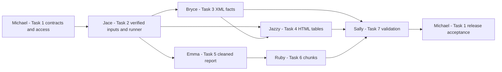

# SEC filing pipeline team implementation plan

Last reconciled with the workspace and related project chats: October 6, 2026. Team: Michael, Jace, Bryce, Jazzy, Emma, Ruby, and Sally.

The next delivery is a reproducible workflow that turns the supplied Microsoft quarterly filing into queryable financial facts, three primary financial statements, cleaned report text, and text chunks with source citations. **AWS RDS setup, the initial database import, and all six individual read-only accounts are complete.** Remaining access work is approving teammates' network addresses and testing connections from their machines. Processing development can start locally now; shared write permissions come later, only for reviewed loaders.

## Current project baseline

| Area | Current position | Implication for this plan |
| --- | --- | --- |
| Source collection | Four local files for Microsoft 10-Q `0001193125-26-191507`: HTML, extracted XBRL XML, extension schema, and filing index. Their local verification passed during this review. | Use these files for the first delivery; additional downloads are not required. |
| Acquisition and export | A fixed-sample downloader/verifier and a separate latest-10-K income-statement CSV exporter exist. | Reuse source verification. Build a processor for the supplied 10-Q; the CSV exporter is not that processor. |
| Storage | PostgreSQL tables, a migration ledger, input classes, storage helpers, and three citation/catalog views exist. | Build transformations around the existing interfaces. |
| AWS RDS setup — completed | The existing instance, schema import, initial metadata import, and maintainer's verified TLS connection are established. The October 6 deployment record contains one company, one filing, four source documents, and no processed content. | Use the existing AWS database. Remaining work concerns processing, ingestion, and any outstanding teammate access. The counts are from the recorded deployment snapshot. |
| Database accounts — completed | Jace, Bryce, Jazzy, Emma, Ruby, and Sally each have an individual login in the `sec_reader` group. The access chat records successful login/read checks and no shared-data write or schema-creation permissions for all six. | Reuse the existing accounts and share each person's credentials privately. Account checks were performed from the already-allowed network. |
| Teammate network access — pending | The latest access chat still records only Michael's network as allowed. Teammate source-IP rules and connections from their own machines have not been verified. | Collect approved public IPv4 addresses, add specific rules, and test each connection. This does not block offline parsing or local database development. |
| Processing | No financial fact extractor, table extractor, report cleaner, chunker, or complete processing runner is present. | Tasks 2–6 implement these missing stages. |
| Collaboration workflow — documented | The GitHub tutorial now requires personal branches and reviewed PRs into `main`. Repository collaborator access and branch-protection enforcement are not confirmed by the tutorial. | Confirm invitations; follow the branch/PR rule immediately; check protection settings separately. |
| Tests and delivery | Existing tests cover acquisition, CSV export, configuration, and database contracts, including synthetic records. Database code, documentation, and configuration also include uncommitted/untracked work. | Preserve the foundation, add real-processing tests, and publish a coherent reviewed baseline before expecting teammates to clone it. |

Relevant existing references: [database access and navigation](../readme.md), [developer usage](developer-usage.md), [GitHub workflow](github-tutorial.md), [database contracts](database.md#schema-and-loader-contract), [AWS deployment status](aws-deployment.md#current-deployment-status-october-6-2026), [storage implementation](../src/sec_pipeline/database.py), [schema and views](../src/sec_pipeline/migrations/001_initial.sql), and [source manifest](../source_manifest.json).

Local verification for this reconciliation: all four original source files passed verification, and 32 offline tests passed. The 11 opt-in live database tests were skipped; that run does not establish new live database or teammate-network results.

### Decisions carried forward from project chats

- **Clarify teammate AWS database access:** individual read-only accounts were created and verified; teammate network access is pending. Michael retains administration and shared imports. Jace may receive restricted loader access when the workflow is ready; the other developers can work locally, and Sally uses read-only access for shared validation.
- **Add beginner GitHub workflow guide:** everyone commits and pushes only to their own branch and submits PRs to `main`. The designated maintainer merges after review. Writing the tutorial did not enable branch protection.
- **Compare online database options:** AWS deployment and metadata migration are complete. The README now covers beginner DBeaver access, the Host-versus-JDBC-URL distinction, and browsing tables/views through their Data tabs.
- **Build project PostgreSQL system**, **Merge remote branch robustly**, and **Set up SEC filing download:** preserve the verified public sample, existing storage contracts, and separate CSV exporter. The earlier published exporter baseline does not mean the later database and documentation changes have been published; current Git status still shows that work locally.

Deployment and account status above reflect the recorded results in those chats. Completion of a login check from Michael's network is separate from successful access on a teammate's computer.

### Findings from the supplied filing

The accession covers Microsoft's period ending March 31, 2026, filed April 29, 2026. Its original files are in [the sample directory](../data/raw/sec/0001193125-26-191507/).

- The XML contains **1,622 fact occurrences** with `contextRef`, using **409 contexts** and **6 units**. Of those facts, 1,428 have `unitRef`, 194 do not, and two are nil. The nil count overlaps the other categories.
- All 1,622 XML fact IDs are unique and present in the HTML; their context and unit references agree. This gives the table team a concrete starting point for verified links. It does not, by itself, validate displayed values or period interpretation.
- The HTML contains **59 tables** and no `h1`, `h2`, or `h3` elements. Table selection and section detection must use headings, surrounding text, anchors, and document context rather than tag names or fixed table positions alone.

These counts apply to the unchanged supplied sample. Broader filing support will need its own inventories and tests.

## First delivery and boundaries

The first delivery includes all XML fact occurrences, the report's visible narrative and readable table text, section-aware chunks, and structured extraction of the primary income statement, balance sheet, and cash-flow statement. It must support both a repeatable local import and a reviewed import into the existing shared database.

Structured extraction of every note table, additional companies/filings, comprehensive-income and equity tables as separate structured outputs, embeddings, semantic search, GraphRAG, a web application, and shared object storage are later extensions. Visible text from the supplied filing's note, comprehensive-income, and equity tables still belongs in the cleaned report. The raw source files remain separate from PostgreSQL; each processor needs matching local files and the manifest.

## Ownership at a glance

| Task | Owner | Main outcome | Main handoff |
| --- | --- | --- | --- |
| 1 Database and integration | Michael | Compatible modules and an accepted processing workflow in the existing AWS database | Contracts and review decisions to everyone |
| 2 Acquisition and ingestion workflow | Jace | Verified inputs and a repeatable processing command | Source identities and coordinated stage execution |
| 3 Financial facts | Bryce | Exact, versioned XML facts with occurrence-level provenance | Facts and scoped fact IDs to task 4 |
| 4 Financial tables | Jazzy | Three faithful statements with verified cell-to-fact links | Tables and link evidence to tasks 2 and 7 |
| 5 Report cleaning | Emma | Complete readable text with reliable sections | Final text and sections to task 6 |
| 6 Chunking and citations | Ruby | Useful text chunks with exact offsets and citations | Chunks and coverage evidence to tasks 2 and 7 |
| 7 Validation and demonstration | Sally | Independent correctness checks and a source-tracing demonstration | Acceptance evidence and defects to task 1 |

## Team access and contribution rules

### Database access now and later

| Person | Current shared-database access | Development and later access |
| --- | --- | --- |
| Michael | Administrator; controls migrations and shared imports | Reviews and runs accepted imports, or authorizes a narrowly scoped loader role |
| Jace | `sec_jace`, read-only | Builds and tests ingestion locally; restricted writes only when shared integration is ready and reviewed |
| Bryce | `sec_bryce`, read-only | Develops facts locally; shared writes only if assigned an approved loader operation |
| Jazzy | `sec_jazzy`, read-only | Develops tables locally; shared writes only if assigned an approved loader operation |
| Emma | `sec_emma`, read-only | Develops cleaning locally; shared writes only if assigned an approved loader operation |
| Ruby | `sec_ruby`, read-only | Develops chunking locally; shared writes only if assigned an approved loader operation |
| Sally | `sec_sally`, read-only | Validates and demonstrates shared results with read-only queries |

All six reader accounts are already created. Michael's immediate access follow-up is to collect each teammate's public IPv4 address, add an approved `/32` rule where needed, and verify DBeaver or Python access from that teammate's machine using `verify-full`. Passwords and personal IP addresses stay outside this plan and version control. Teammates do not need AWS console access to use these database accounts.

Offline extraction and local loader tests do not require shared write access. Michael can run the first reviewed shared import. Any later write grant must match the approved loader's actual tables and operations; do not give everyone write access merely because they own a processing module.

### GitHub contribution workflow

Follow the [beginner GitHub guide](github-tutorial.md):

1. Confirm repository collaborator access independently of database access.
2. Create a task branch from the latest `main`, named `your-name/short-task`.
3. Commit and push only to your own branch. Never commit or push directly to `main` or another teammate's branch, and do not force-push shared history.
4. Open a PR with base `main`, including the change, tests/evidence, and handoff notes. Make review fixes on the same personal branch.
5. Michael reviews and merges through the PR after the required checks. Start a new branch for the next task.

Michael should confirm whether `main` protection already enforces reviewed PRs and blocks direct-push bypasses; configure it if needed. Its enforcement is currently unverified, not a completed setup item. These rules also govern publishing the outstanding database/documentation baseline.

## Task 1 Database and integration

**Owner:** Michael. **Goal:** integrate the team's modules with the existing AWS database, maintain stable interfaces, and verify that a complete processed-filing import can be repeated or rolled back safely.

### Already completed

- AWS RDS instance setup and initial connectivity configuration.
- Import of the existing schema and Microsoft filing/source metadata.
- Maintainer connection verification with TLS and local/cloud data comparison.
- Creation and verification of all six individual read-only accounts.

AWS provisioning, the initial database migration, and reader-account creation are complete prerequisites. Michael's remaining responsibilities are integration, PR review, teammate network onboarding, and any later narrowly scoped loader permissions.

### Work to complete

1. Review and package the existing database changes through a personal branch and PR to `main`, so teammates can obtain the same working schema, dependencies, tests, and documentation. Confirm GitHub invitations and branch-protection enforcement. Preserve unrelated local changes and use the deployed AWS database as the shared integration destination.
2. Confirm the shared contracts below with all owners. Decide version labels, provenance fields, section metadata, cell identifiers, error reporting, and the exact first-delivery boundary before modules diverge.
3. Reuse the six existing reader accounts. Complete approved source-IP rules and connection checks from teammate machines, using the README's access/navigation guide. Keep shared writes with Michael initially; review Jace's required operations before granting a restricted loader role. Check comparison reads and row locks as well as inserts. A catalog query is sufficient for basic reader onboarding; `sec-db status` is an administrative diagnostic with broader requirements.
4. Own schema evolution and code integration. Reuse the existing input classes and helpers; add a new migration only when an agreed requirement cannot fit the current schema. Never modify an already-applied migration.
5. Design filing-scoped snapshots that record IDs, complete content or deterministic content hashes, versions, source checksums, and table/fact relationships. Compare the first and second successful imports; counts alone are insufficient to prove unchanged results.
6. Coordinate late-stage failure tests in a dedicated local test database. Confirm that a failure leaves no partial new import. Review task 7's results and resolve required failures before loading the accepted version into the shared database.

### Deliverables and acceptance

- A reviewed repository baseline delivered through a PR, interface decisions, and separate account/network/access-permission status for each teammate.
- Integration tests and evidence for repeat imports, changed-content conflicts, and whole-import rollback.
- A release checklist identifying the exact filing, source checksums, processing versions, destination, and validation result.
- **Complete when:** every module uses the agreed contracts; required team connections work; a real filing passes validation; reruns preserve IDs/content; a deliberate failure preserves the previous database state; and the shared import can be read through the intended accounts.

**Dependencies and boundary:** begins immediately using the completed AWS setup and reader accounts, and continues throughout delivery. Jace owns the runner implementation in task 2; Michael owns its integration policy, shared imports, and PR review. Teammate network onboarding can proceed alongside offline development.

## Task 2 Acquisition and ingestion workflow

**Owner:** Jace. **Goal:** provide one explicit, repeatable route from the existing manifest and raw files to a validated database import, with clear failures and no partial writes.

### Work to complete

1. Make the existing sample the default input. Reuse the downloader's local verification behavior: `load_manifest()` returns a manifest; `verify_sample()` returns normally on success and raises on failure. Verify paths, document identities, sizes, hashes, and required roles. Stop on a missing or changed source instead of silently downloading a replacement.
2. Resolve registered metadata with `seed_manifest()` or agreed read interfaces. Its `document_ids` result is keyed by manifest `local_path`, not source role. Resolve roles through the manifest and pass the XML UUID to facts, and the HTML UUID to reports/tables.
3. Build a runner that coordinates facts, tables, report cleaning, chunking, and validation. Keep parser functions independent of credentials and database connections. Storage functions receive the caller's connection and leave the commit decision to the runner.
4. Coordinate one transaction for metadata and all new outputs. Load facts before their table links and the report before its chunks. Run validation for the exact requested versions before committing; propagate a failed or unverified required check as an import failure.
5. Provide explicit input, destination/env-file, version, reference-check, and dry-run options. The dry run must verify and parse without a database connection or writes. Temporary in-memory IDs used during dry runs must never be persisted. Imports and command help must have no side effects.
6. Report the accession, source hashes, processing versions, expected/extracted/stored counts, rejected items, unresolved cells, and validation outcome. Provide actionable stage errors without logging credentials. Keep source acquisition policy intact if broader downloads are later requested.

### Deliverables and acceptance

- A processing command, orchestration module, dry-run behavior, and documented usage in the developer guide.
- Offline tests for corrupt/missing input, source-ID mapping, dry-run isolation, and failed stages; coordinated database tests for rollback and replay.
- **Complete when:** one command processes the real supplied filing; dry-run needs no database; the real run targets an explicitly selected database; required validation passes before commit; reruns are stable; failures leave no partial output; and no SEC requests or raw-source changes occur during sample processing.

**Dependencies and boundary:** starts source verification and runner tests immediately. Jace's current shared login is read-only; develop and test writes locally, then have Michael run the reviewed shared import or grant approved restricted loader access. Integration depends on tasks 3–7. Existing `.env` and `.env.aws` configurations select different destinations; process `PG*` variables override file settings. Preserve the current `sec-pipeline` CSV command as its separate workflow.

## Task 3 Financial facts

**Owner:** Bryce. **Goal:** represent every fact occurrence in the supplied XML faithfully, preserving exact values and enough context to identify what each value means and where it came from.

### Work to complete

1. Inventory fact elements, contexts, units, and dimensions. For the supplied unchanged XML, reconcile against 1,622 occurrences. Account for every occurrence as extracted or explicitly failed; a successful first delivery has no unexplained or unsupported omitted facts.
2. Parse locally with network and external entity resolution disabled. Use supplied evidence without making taxonomy or label downloads a prerequisite. Identify types from available XBRL evidence; do not turn numeric-looking text into a numeric fact by guesswork.
3. Populate `FactInput` with namespace URI and concept name, raw lexical value, exact `Decimal` where numeric, nil status, reported decimals/precision, and the correct instant/duration/forever period. Preserve nonnumeric facts. Nil and zero must remain distinct, and quarterly and year-to-date values must remain separate occurrences.
4. Preserve full unit definitions, explicit dimensions, and complete typed-member values with namespaces. Retain context identifiers, entity detail, and relevant context placement in `source_reference`, because the current table has no separate context/entity columns.
5. Define a deterministic occurrence key from the original element ID or a stable locator. Repeated concepts or equal values are not duplicates to collapse. Store source ID/path, `contextRef`, `unitRef` when present, namespace resolution, and value provenance.
6. Separate extraction from loading through `store_fact()`. Return IDs with explicit filing, XML source-document, and extraction-version scope. Give task 4 the occurrence-key convention and verified HTML/XML correspondence information.

### Deliverables and acceptance

- A fact extractor/loader, source inventory, occurrence-key specification, and documented field mapping.
- Tests for exact decimals, negatives, zero, text, nil, all period forms, compound units, namespace aliases, explicit/typed dimensions, repeated occurrences, missing references, unsupported values, and deterministic output.
- **Complete when:** all 1,622 occurrences are faithfully represented for the selected version; the inventory and stored counts reconcile; both nil occurrences are preserved; independent checks match source values/context; `sec.fact_provenance` reaches the correct XML evidence; and repeat loading retains IDs while changed content under the same version fails.

**Dependencies and boundary:** verified source paths and registered IDs come from task 2. Task 4 consumes facts and scoped IDs; task 7 independently checks accuracy. Financial ratios, aggregation, and cross-company concept normalization are outside this task.

## Task 4 Financial tables

**Owner:** Jazzy. **Goal:** let a reader reconstruct the primary income statement, balance sheet, and cash-flow statement and trace each applicable financial data cell to a verified fact occurrence.

### Work to complete

1. Identify the three statements from headings, surrounding context, row labels, and periods. Distinguish statements from layout and note tables among the 59 HTML tables. Avoid hard-coded document-order positions.
2. Preserve row/column order, merged-cell meaning, headings, totals, footnotes, blanks, dashes, signs, units, and scale qualifiers. Keep displayed text separate from XML values; display scaling, formatting, and rounding may differ.
3. Define stable table keys and cell locators. Populate `FinancialTableInput.structure` with inspectable JSON and `readable_text` with a human-readable representation. Preserve the original HTML location, row/column headings, periods, scales, and cell classifications.
4. Use the sample's matching inline/XML IDs as the initial linking method, then verify concept, context, unit, and source evidence. Never match on amount alone. If several candidates remain, mark the cell unresolved instead of treating every candidate as a valid link.
5. Retain HTML provenance for tables and XML provenance for facts, with distinct document UUIDs within the same filing. Store cell-level references in `structure`; `financial_table_facts` stores table-to-fact membership only.
6. Load tables and relationships through existing helpers in the import transaction. Check that linked facts belong to the intended filing, XML source, and fact version. Produce an inventory of resolved, non-fact, and unresolved cells for independent review.

### Deliverables and acceptance

- A table extractor/loader, structure specification, readable statements, and cell-link inventory.
- Tests for statement selection, merged cells, period/scale interpretation, signs/blanks, stable locators, repeated amounts, ambiguity, invalid fact scope, and missing IDs.
- **Complete when:** all three statements preserve the source layout's financial meaning; every in-scope financial cell has a verified link or an independently reviewed reason no source fact applies; unexplained gaps are zero; cell references agree with stored table/fact memberships; and invalid references roll back the intended import.

**Dependencies and boundary:** layout extraction starts immediately. Final linking depends on task 3's occurrence keys and scoped fact IDs. Task 5 retains readable table text in the report but does not own these structured statements. Other table families are later scope.

## Task 5 Report cleaning

**Owner:** Emma. **Goal:** produce a readable, complete version of the filing's visible content with stable sections, so downstream chunks remain meaningful and traceable.

### Work to complete

1. Define inclusion and removal rules. Preserve visible prose, headings, footnotes, inline financial values, and readable table text. Remove scripts, styles, hidden XBRL payloads, and justified navigation/repeated header material. Record removal categories so genuine content loss can be distinguished from deliberate cleanup.
2. Capture original element IDs or XPath locations before altering the parse tree. Keep the raw HTML unchanged. A locator from a transformed tree is not proof of an original-source location.
3. Normalize whitespace deterministically while retaining paragraph and table row/cell boundaries. Finalize `full_text` before calculating any offsets.
4. Detect sections using styled text, part/item context, and anchors. The sample has no ordinary heading tags and repeats some labels in navigation or page headings. Inspect ambiguous cases; retain uncertain content under deterministic fallback sections rather than dropping it.
5. Supply an ordered section list with identifiers, titles, original-source locators, and zero-based, half-open Unicode offsets into final `full_text`. Sections must not overlap and must cover every retained non-whitespace character, including headings.
6. Return `ReportInput` and load through `store_report()`. Give task 6 the finalized text, section metadata, extraction version, and stored report ID after integration. Changes to finalized text require a new report version.

### Deliverables and acceptance

- A report cleaner/loader, documented cleanup rules, section listing, and sample cleaned output.
- Tests for visible/hidden inline XBRL, table spacing, styled headings, navigation/repeated headings, fallback sections, malformed input, Unicode, deterministic cleanup, and section coverage.
- **Complete when:** independent beginning/middle/end checks preserve the filing's meaning and visible values; all retained text belongs to valid sections; every supplied locator resolves; missing locators are explicitly identified; and task 6 can consume the report without further normalization.

**Dependencies and boundary:** can begin immediately with local HTML. Coordinate section metadata with task 6 and readable table representation with task 4. Source-document provenance and a section locator do not establish an exact original-HTML location for every cleaned character; finer mapping is a separate design choice.

## Task 6 Chunking and citations

**Owner:** Ruby. **Goal:** divide the cleaned report into manageable text units without losing content, crossing section boundaries, or breaking the link between each chunk and its source report.

### Work to complete

1. Validate task 5's section ranges and coverage. Reject invalid boundaries or unexplained gaps rather than silently accepting incomplete input.
2. Define paragraph-aware splitting, short-section behavior, long-paragraph splitting, whitespace handling, and overlap. Begin with configurable character limits, such as 1,500 maximum characters and 150 overlap; review their usefulness on actual filing text before fixing the policy.
3. Create text only by slicing the finalized report. Every record must satisfy `chunk.text == report.full_text[offset_start:offset_end]`. Do not strip, add headings, or normalize after slicing. Offsets count Python Unicode characters, not bytes or UTF-16 units.
4. Keep chunks inside a single section, give them consecutive zero-based indexes across the report, and preserve section identity, title, settings, and chunking version. Guarantee forward progress even for tiny limits, large overlap, or oversized paragraphs.
5. Store the report first, then use `store_chunk()` within the shared transaction. Query resulting IDs through `sec.chunk_citations`; verify the filing, report, source path/hash/URL, and offsets.
6. Produce a coverage report and representative early/middle/final chunks. Check useful boundaries and readability with tasks 5 and 7 in addition to passing mechanical slice tests.

### Deliverables and acceptance

- A configurable chunker/loader, documented boundary policy, coverage results, and citation examples.
- Tests for empty/short sections, long paragraphs, multiple sections, invalid ranges/settings, whitespace, one-character limits, near-maximum overlap, accents, combining marks, CJK, and emoji.
- **Complete when:** every chunk is an exact bounded slice within one section; every non-whitespace report position is covered; no chunk exceeds the selected size limit; reruns are deterministic; processing always advances; and stored citations resolve to the correct report and original document.

**Dependencies and boundary:** develop with clearly labeled fixtures while task 5 is underway. Real integration needs finalized report text and its stored ID. This task supplies text and citations, not embeddings or search. The citation view gives cleaned-report offsets and document provenance; do not present those offsets as original-HTML coordinates.

## Task 7 Validation and demonstration

**Owner:** Sally. **Goal:** provide independent evidence that the complete workflow is correct, complete within the agreed scope, and understandable to someone reviewing the original filing.

### Work to complete

1. Build a small reference set directly from original sources before copying any extractor results. Proposed minimum: 20 numerical occurrences across different periods/units/dimensions where present, four nonnumeric facts, both nil occurrences, three reviewed cells from each primary statement, and six passages across at least three sections. Record original locators and source hashes. Have another teammate review the expected values.
2. Store exact numerical expectations as decimal strings, with namespace/concept, raw value, period, units, dimensions, context, and occurrence evidence. Include displayed table values and scales separately. Use explicitly synthetic fixtures only for edge cases absent from the real sample.
3. Implement validation scoped to accession, source checksums, and the exact facts/tables/reports/chunks versions passed by the runner. Older successful versions must not hide omissions in a new run. The catalog's total counts alone cannot provide version-specific acceptance.
4. Reconcile the full fact inventory, table-cell classifications and links, retained report sections, and chunk coverage. Selected examples and nonempty tables are necessary checks, but do not prove completeness. Unexplained missing facts, uncovered text, or unresolved applicable primary-statement cells fail acceptance.
5. Check every stored chunk against its report slice. Join `sec.chunk_citations` to `sec.reports` by `report_id` to obtain `full_text`; the citation view does not contain it. Independently compare reviewed passages with original HTML because report cleanup changes whitespace.
6. Return structured results with expected/actual values, evidence, and passed/failed/unverified states. Zero checks, skipped checks, and missing implementations cannot count as success. Give the runner a clear overall gate and save a new, version-identified result without overwriting earlier evidence.
7. Prepare read-only demonstration queries for the filing catalog, fact provenance, chunk citations, and financial tables with linked facts. Reuse the README's DBeaver navigation walkthrough for nontechnical readers. Show one numerical fact, one statement cell, and one passage all the way back to original evidence. Include task 1's replay/rollback results and any reviewed limitations.

### Deliverables and acceptance

- Independently reviewed reference fixtures, a validation module, tests that deliberately introduce mismatches, and an inspectable validation report.
- A small SQL demonstration and a short walkthrough suitable for the team presentation.
- **Complete when:** all required checks execute and pass for the selected versions; full-scope counts and coverage reconcile; unresolved required links are zero; the source-tracing demo works on real data; and reviewers can distinguish source evidence, processed output, and test fixtures.

**Dependencies and boundary:** source review begins immediately; Sally's existing shared account remains read-only. Shared demonstrations need her network access to be enabled, while reference preparation and local tests can proceed now. Output validation depends on tasks 2–6. Task 1 owns release and transaction acceptance; this task independently checks content correctness. Each implementation owner remains responsible for their own tests.

## Shared contracts to settle before implementation

The existing Python input classes and SQL constraints are established interfaces. The more specific conventions below are proposed team decisions to finalize at the first checkpoint.

| Contract | Proposed agreement |
| --- | --- |
| Processing versions | Separate labels for facts, tables, reports, and chunks, initially `facts-v1`, `tables-v1`, `reports-v1`, and `chunks-v1`. Pass the exact set to validation. Record policy/settings with the relevant output. |
| Source identities | Resolve filing/document UUIDs from metadata. Facts reference XML; reports and tables reference HTML. Preserve source URLs, local paths, and SHA-256 hashes. |
| Fact handoff | Records use `FactInput`. Fact-ID mappings carry filing, XML document, and version scope. A bare occurrence-key dictionary is usable only within that declared scope. |
| Table structure | Include stable cell locators, row/column headings, displayed values, periods/scales, source locators, fact occurrence references and scope, and unresolved reasons. JSON values must be serializable. |
| Sections | Use `section_id`, `title`, `offset_start`, `offset_end`, and `source_locator`. Ranges are ordered and nonoverlapping. Empty locators must be disclosed as unresolved, not verified evidence. |
| Chunk metadata | Include section ID, selected maximum size/overlap, and the policy version. Every text value remains an exact final-report slice. |
| Value fidelity | Use `Decimal` for numerical facts and preserve raw text separately. Preserve nil, repeated occurrences, units, dimensions, and period distinctions. Never silently coerce an unsupported value. |
| Transactions and replay | Storage functions use the supplied connection and never independently commit. The runner owns one complete import transaction. Identical content/version preserves IDs; changed content requires a new version. |
| Errors and evidence | Distinguish malformed source, unsupported extraction, unresolved mapping, database failure, and failed validation. Record actionable evidence without credentials. Required failures block acceptance. |

## Delivery sequence

**Completed prerequisites:** AWS RDS setup, initial schema/metadata import, maintainer connectivity verification, and all six reader accounts tested from the allowed network. The GitHub contribution guide and beginner database-navigation guide are also available. The checkpoints below cover remaining onboarding, implementation, and data handoff.

This diagram shows data dependencies, not a requirement to wait before starting work. Task 7 starts source checks immediately; task 4 starts layout work before fact linking is ready; task 6 starts with fixtures while the cleaner is developed.

| Checkpoint | Exit evidence | Work that can proceed in parallel |
| --- | --- | --- |
| A Team readiness | GitHub invitations confirmed, baseline reviewed through a PR, personal branches ready, contracts agreed, matching sources verified | Enable teammate source-IP rules and test their reader connections; begin source review and offline development immediately |
| B First module outputs | Fact inventory, one primary table draft, cleaned sections, and fixture-based chunks can be inspected | Facts, tables, cleaning, runner development, and validation fixtures |
| C Complete local processing | All sample facts, three primary statements, full cleaned report, and chunks pass module checks | Resolve mapping/content defects while improving integration tests |
| D Integrated acceptance | One command loads and validates all selected versions locally; replay and deliberate-failure rollback pass | Review PRs, prepare demo, and confirm Michael's shared-import route or approved restricted loader permissions |
| E Shared handoff | Reviewed versions loaded into the existing shared database; teammate reader access and source-tracing demo succeed | Document known limits and choose the next scope |

The main dependency chains are facts → table links and cleaned report → chunks. Review the first outputs early, especially the fact-key and section contracts, to avoid late integration rework.

## Proposed implementation locations

These are future implementation locations, not existing commands or starter files. Confirm names during checkpoint A; retain the current public storage interfaces.

| Owner | Proposed files |
| --- | --- |
| Michael — Task 1 | Existing `database.py` and migrations as needed; `tests/test_processing_integration.py`; updates to access/contract documentation |
| Jace — Task 2 | `src/sec_pipeline/processing.py`, `scripts/process_filing.py`, `tests/test_processing.py` |
| Bryce — Task 3 | `src/sec_pipeline/fact_extraction.py`, `tests/test_fact_extraction.py` |
| Jazzy — Task 4 | `src/sec_pipeline/table_extraction.py`, `tests/test_table_extraction.py` |
| Emma — Task 5 | `src/sec_pipeline/report_cleaning.py`, `tests/test_report_cleaning.py` |
| Ruby — Task 6 | `src/sec_pipeline/chunking.py`, `tests/test_chunking.py` |
| Sally — Task 7 | `src/sec_pipeline/validation.py`, `tests/test_processing_validation.py`, `tests/fixtures/reference_checks.json`, `docs/demo_queries.sql` |

Keep derived sample outputs and full run reports under ignored `data/processed/`. Commit compact, source-linked reference fixtures and reproducible commands on the owner's personal branch, then submit a PR to `main`. Every owner should include a short handoff with input/output formats, version, run/test commands, evidence, and limitations. Update the existing developer guide with the final integrated command.

## Final acceptance checklist

- [x] AWS RDS setup, initial schema/metadata import, and maintainer connectivity verification are complete.
- [x] All six individual read-only accounts have been created and verified from the allowed network.
- [x] Beginner database-access/navigation and personal-branch/PR guides are available.
- [ ] Repository collaborator access and enforcement of the reviewed-PR rule for `main` are confirmed.
- [ ] Teammate network rules are approved and reader connections work from the required teammate machines.
- [ ] Every teammate has the same reviewed code baseline and matching source files.
- [ ] The sample's four original files and manifest remain unchanged.
- [ ] All 1,622 XML fact occurrences are represented for the chosen fact version, with exact value/context semantics.
- [ ] The three primary statements preserve their financial meaning and have no unexplained applicable-cell link gaps.
- [ ] Cleaned text retains in-scope visible content; sections and chunks have complete non-whitespace coverage.
- [ ] Fact and chunk citations resolve to the correct filing, source document, and selected processing version.
- [ ] Independent real-source checks pass; skipped or missing checks are identified as unverified.
- [ ] An identical second import preserves IDs/content; a late failure leaves no partial new import.
- [ ] Existing regression tests and new module/integration tests pass in the appropriate environments.
- [ ] The reviewed shared import is accessible from the required teammate machines using their assigned accounts.
- [ ] A reviewer can reproduce the import and trace a fact, a table cell, and a passage back to original evidence.

Existing live database tests are opt-in and require an empty, migrated, dedicated test database. Follow [the database testing guide](database.md#handoff-and-acceptance); never substitute the shared application database for that test environment. Completing this plan requires evidence from the actual processing workflow, beyond the existing synthetic storage tests.
